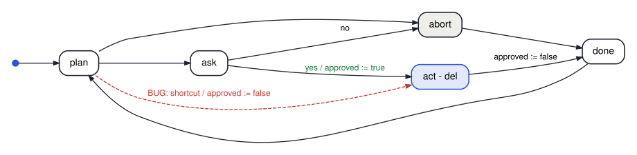

# cs3892-2026-10-01-linear-temporal-logic

Session 11 — linear temporal logic: `X`, `G`, `F`, `U`; safety versus liveness;
writing English requirements as formulas, and the ways that goes wrong; temporal
properties over agent logs.

The agent of `03`/`04` as a transition system — the dashed edge is the bug that `03` has and `04` does not:

| File | Shows | Verdicts | Tool |
|---|---|---|---|
| `smv/01_counter_operators.smv` | the four operators on the running example (one run: 0 … 10, 0 …) | `X`, `G`, `F`, `U` true · `(x < 5) U (x = 10)` false · `G F` true · `F G` false | NuSMV / nuXmv |
| `smv/02_mutex_safety_liveness.smv` | two processes, one lock, a scheduler the model checker controls | mutual exclusion true · `!crit_a` false as invariant **and** as LTL (compare the traces) · no-starvation false, with a lasso | NuSMV / nuXmv |
| `smv/03_agent_approval_buggy.smv` | *"never delete anything unapproved"*, three formalizations, on an agent with a shortcut bug | the right one false · a precedence slip true · the converse true | NuSMV / nuXmv |
| `smv/04_agent_approval_fixed.smv` | the same agent without the bug; strong vs weak until | `G (del -> approved)` true · `!del U approved` false · `(!del U approved) \| G !del` true | NuSMV / nuXmv |
| `python/05_monitor_agent_logs.py` | the same kind of property checked on finite agent logs | safety: violated / inconclusive · `F`: satisfied / inconclusive · response: always inconclusive | Python |

Every SMV verdict was run under **NuSMV 2.6.0** and **nuXmv 2.2.0**, and every file
parses and checks in **smvis** ([bit.ly/fmaiv_smvis](https://bit.ly/fmaiv_smvis)) with
the same verdicts. The notebook asserts all of them.

**smvis note.** Its LTL-to-Büchi step names atomic propositions `p0`, `p1`, … internally,
so a model with a variable called `p1` or `p2` fails *Compose & Analyze* with "maximum
recursion depth exceeded". That is why the processes in `02` are `a` and `b`.
