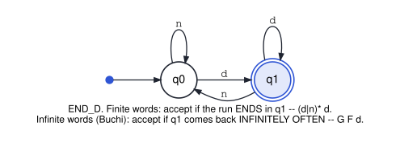

# cs3892-2026-10-08-regular-languages-and-buchi-automata

Session 13. It starts with finite words: regular expressions, DFAs and NFAs, what *accept*
means, and Kleene's equivalences. Then it moves to infinite words: the **same automata** read
with **Büchi acceptance**, ω-regular languages, why nondeterminism now matters, and the
automata-theoretic recipe for LTL model checking.

The alphabet throughout is one bit per step of session 11's agent: **d**, it deleted something,
or **n**, it did not. A finite log is a word over `{d, n}`, and a reactive run is an infinite one.

The automaton the session is built on is END_D, "the last letter was d". Read on finite words,
it accepts `(d|n)* d`. Read on infinite words, with Büchi acceptance, it accepts `G F d`:

| File | Shows | Verdicts | Tool |
|---|---|---|---|
| `python/01_regex_and_dfa.py` | regexes vs a DFA on every word up to length 12; product = intersection, complement, emptiness = reachability; equivalence as an empty symmetric difference | the DFA and `[dn]*d` agree on all 8191 words · `(n*d)*` differs from them on the empty word | Python |
| `python/02_nfa_subset_construction.py` | NFAs that guess: for END_D's own language the subset construction gives END_D back; for `(d\|n)* d (d\|n)` it costs states, and minimization shows the `2^k` blowup is unavoidable | 2-state NFA → END_D · 3-state NFA → 4-state DFA · `k + 1` NFA states → `2^k` minimal DFA states, for `k` = 1…8 | Python |
| `python/03_buchi_acceptance.py` | Büchi acceptance on lasso words `u(v)^ω`: END_D read as Büchi is `G F d`; an NBA for `F G n`; "d at every even position" | all three agree with their meaning on 210 lassos · **no** complete deterministic Büchi automaton with ≤ 3 states accepts `F G n` (5832 searched, each refuted by a lasso), while 408 agree with `G F d` on every test lasso | Python |
| `smv/01_ends_with_d.smv` | END_D as an SMV transition system reading an unconstrained input; NuSMV checks that its Büchi acceptance is `G F d` | true · true · `G F (q = q1)` false, counterexample `d (n)^ω` | NuSMV / nuXmv |
| `smv/02_mutex_composition.smv` | parallel composition: two instances of one module, a scheduler that makes them interleave, and the composed system as one transition system over pairs of states | mutual exclusion true (the pair `crit, crit` is unreachable) · `EF crit` true for both · `AG EF` start true · `G F (m1.st = crit)` false, a lasso | NuSMV / nuXmv |

The recipe itself, on the agent, is session 12's `python/04_buchi_emptiness.py`. The notebook
runs it again and checks that NuSMV agrees.

Every SMV verdict was run under **NuSMV 2.6.0** and **nuXmv 2.2.0**. The notebook asserts all of
them, and the Python files assert their own.
