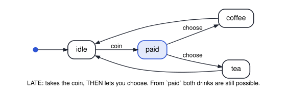

# cs3892-2026-10-13-equivalence-simulation-and-bisimulation

Session 14. When are two systems *the same*? Trace equivalence, simulation and bisimulation;
what each one preserves (LTL for the first, all of CTL\* for the last); computing bisimilarity
by partition refinement; and why an abstraction that simulates a system lets you prove
properties of the system on the abstraction.

Two vending machines carry most of the session. LATE takes the coin and then lets you choose;
EARLY commits to a drink as it takes the coin. They have the same traces and are not bisimilar:

| File | Shows | Verdicts | Tool |
|---|---|---|---|
| `smv/01_vending_late_choice.smv` | the machine that lets you choose after paying | CTL `AG (paid -> EX coffee & EX tea)` true · four LTL specs: true, true, false, false | NuSMV / nuXmv |
| `smv/02_vending_early_choice.smv` | the machine that commits as it takes the coin | the same CTL spec **false** · the same four LTL verdicts | NuSMV / nuXmv |
| `python/03_three_equivalences.py` | trace equivalence (by the subset construction), the greatest simulation and the greatest bisimulation, on two pairs of machines | LATE/EARLY: same traces, LATE simulates EARLY only, not bisimilar · FAIR/JAMS: simulate each other, not bisimilar | Python |
| `python/04_partition_refinement.py` | partition refinement, round by round, and the quotient | END_D3 (3 states) → END_D (2) · the vending machines' initial states end in different classes | Python |
| `python/05_abstraction_simulates.py` | the agent abstracted to two states; property transfer; a spurious counterexample and its refinement | "never two deletes in a row" transfers · `del, quiet, del` is spurious · a 3-state refinement proves the second property | Python |
| `smv/06_agent_abstract.smv` | the two-state abstraction, with both properties in LTL | true · false (the spurious run) | NuSMV / nuXmv |
| `smv/07_agent_concrete.smv` | the agent itself, with the same two properties | true · true | NuSMV / nuXmv |

Every SMV verdict was run under **NuSMV 2.6.0** and **nuXmv 2.2.0**. The notebook asserts all of
them, and the Python files assert their own.
