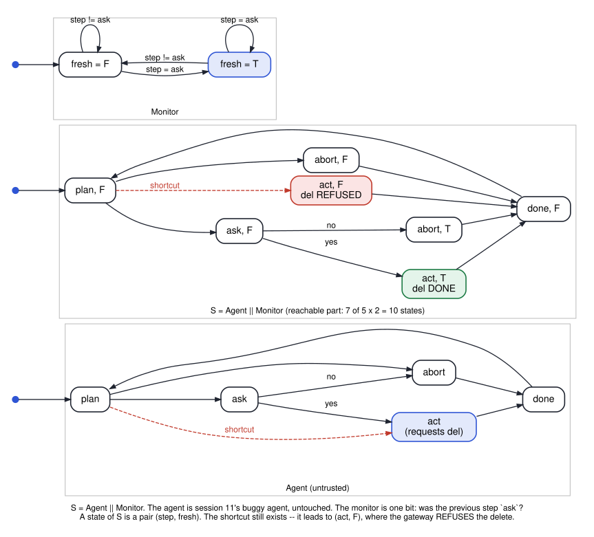

# cs3892-2026-10-15-specifications-in-practice

Session 15. Where specifications come from in practice, and when they are checked. One rule for
one agent — *never delete without a human's approval* — written four ways: as a per-request
authorization policy (Cedar), as a policy over the history of tool calls (Dogwood), as temporal
logic checked on a model (NuSMV), and as requirements written before any code (EARS, as used by
Kiro). Then an LLM's *answer* checked against rules by a solver (Bedrock Automated Reasoning checks).

**Nothing here calls AWS.** The Python files are small models of the published semantics, each
labelled a toy in its header; the facts they rest on are cited there. `02` replays the trace that
AWS published with Dogwood and gets the same decisions; `06` gets the same conflicts that Kiro's
post reports.

The session's main picture is a monitor placed beside an agent that is still buggy:

| File | Shows | Verdicts | Tool |
|---|---|---|---|
| `python/01_cedar_decision_in_z3.py` | a per-request policy as a formula: default deny, forbid overrides permit, a permit that can never fire, two versions compared | nothing allowed with no policies · an agent never deletes more than 10 files · the dead permit is unsat · `<= 100` vs `< 100` differ at 100 | Z3 |
| `python/02_history_monitor.py` | `formerly` / `previous` / `since` with windows, as the Dogwood guide defines them, and a gateway loop | AWS's trace: DENY, ALLOW, DENY · the agent: three policies, three different rows · a limit that counts responses lets 8000 through | Python |
| `smv/03_agent_history_ltl.smv` | the buggy agent with the requirement in past-time LTL (`Y`, `O`) | false · true (`approved` is a one-bit monitor) · false · false · false (one ask would cover every later delete) | NuSMV / nuXmv |
| `smv/04_agent_with_gateway.smv` | `S = Agent ∥ Monitor`: the same buggy agent behind a gateway | safety **true** · the agent still tries: false · refusals are exactly the forbidden requests: true · liveness `G F del_done`: false | NuSMV / nuXmv |
| `python/05_answer_check_findings.py` | VALID / INVALID / SATISFIABLE / IMPOSSIBLE as four solver queries, on rules written in SMT-LIB | one of each · why IMPOSSIBLE is checked first · what VALID does not cover · two translations that differ at 100 | Z3 |
| `python/06_ears_requirements_in_z3.py` | EARS requirements as implications: conflicts and gaps | the Kiro post's example: `{R2, R3}`, `{R1, R5}`, and the gap · the gateway's own requirements: one conflict, one gap | Z3 |

Every SMV verdict was run under **NuSMV 2.6.0** and **nuXmv 2.2.0**. The notebook asserts all of
them, and the Python files assert their own.

Sources for the facts (all read October 2026): the Cedar documentation and paper (Cutler et al.,
OOPSLA 2024); the Dogwood announcement and language guide (`github.com/dogwood-policy/dogwood`);
the Amazon Bedrock AgentCore and Guardrails user guides; An et al., CAV 2026 (arXiv:2511.09008);
`kiro.dev/blog/deep-spec-analysis`; Mavin et al., RE 2009 (EARS).
